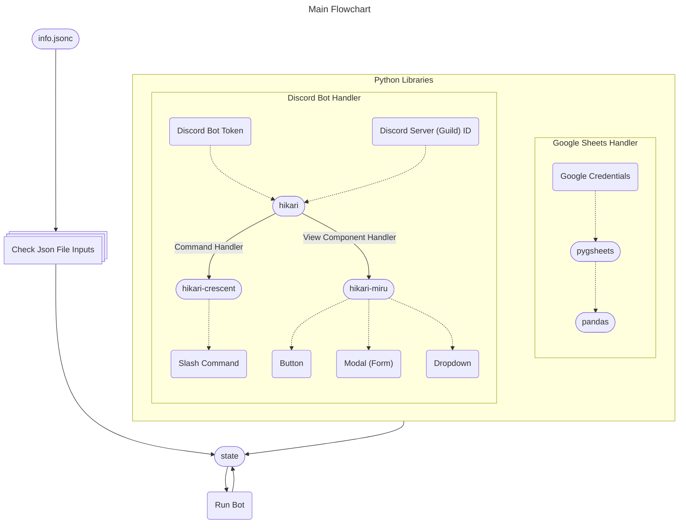

Created using [Mermaid](https://mermaid.js.org/syntax/flowchart.html).

```mermaid
---
title: Main Flowchart
---
flowchart TB
  subgraph libs["Python Libraries"]
    direction LR
    subgraph discord["Discord Bot Handler"]
      hikari(["hikari"])
      crescent(["hikari-crescent"]) -.-> slash("Slash Command")
      miru(["hikari-miru"]) -.-> button("Button") & modal("Modal (Form)") & dropdown("Dropdown")
      hikari -- Command Handler --> crescent
      hikari -- View Component Handler --> miru
      token("Discord Bot Token") & guild("Discord Server (Guild) ID")-.-> hikari
    end
    subgraph gsheets["Google Sheets Handler"]
      direction TB
      creds("Google Credentials") -.-> pygs([pygsheets])
      pygs -.-> pd([pandas])
    end
    discord ~~~ gsheets
  end
  info(["info.jsonc"]) --> checkinfo@{shape: procs, label: "Check Json File Inputs"}
  checkinfo --> state(["state"])
  libs --> state
  state --> run("Run Bot") --> state
```
